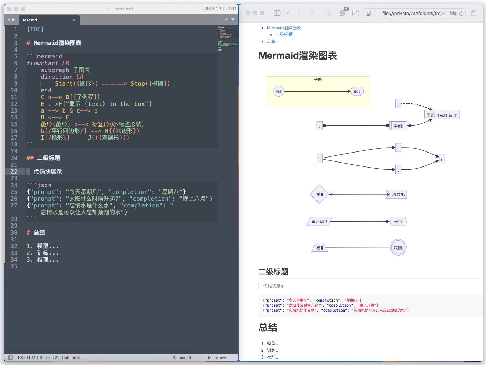

# sublime-preview-mermaid

> Sublime实时预览Mermaid图表。

效果如图



# 1 原理说明

使用Sublime Text配合`MarkdownPreview`、`LiveReload`插件实现对md文件的编辑时的实时预览。

但MarkdownPreview插件不支持Mermaid图表的渲染，通过在MarkdownPreview配置中自定义html，引入`npm/mermaid`，实现渲染Mermaid图表。

为什么不用MarkdownLivePreview，仅仅就因为`MarkdownLivePreview`插件的预览内容显示不全会被截断，并且还不能滑动查看，简直不可用。

# 2 为什么一定要用Sublime

因为Sublime轻，插件多，方便打稿纸和查看文件，侧边栏可快速查看常用文件，最后是跨平台。

# 3 开启Sublime实时编辑预览

1. 安装插件，`MarkdownPreview`、`LiveReload`

2. 在Sublime打开一个md文件

3. 开启MarkdownPreview实现浏览器预览 

    ctrl+shift+p，输入关键字找到`Markdown Preview:Preview in Browser`，再选择`markdown`，就会弹出浏览器预览。此时编辑md内容，浏览器不会自动刷新，也不能渲染Mermaid图表。

4. 开启LiveReload实现浏览器实时刷新

   ctrl+shift+p，输入关键字找到`LiveReload:Enable/disable plug-ins`，再选择`Enable - Simple Reload`，就开启了热加载，每次ctrl+s保存后都会自动刷新页面。

# 4 配置MarkdownPreview支持渲染Mermaid图表

1. 下载`mermaid_template.html`

    > https://raw.githubusercontent.com/dirtydamn1/sublime-preview-mermaid/refs/heads/master/mermaid_template.html

2. 编辑MarkdownPreview的自定义配置

    在Sublime首选项，Package Settings，Markdown Preview，Settings。
    在右侧自定义配置中添加如下内容：
    
    ```json
    {
      "html_template": "/绝对路径/mermaid_template.html"
    }
    ```
3. 回到刚打开的md保存一下，浏览器就会自动刷新，并渲染Mermaid图表。

